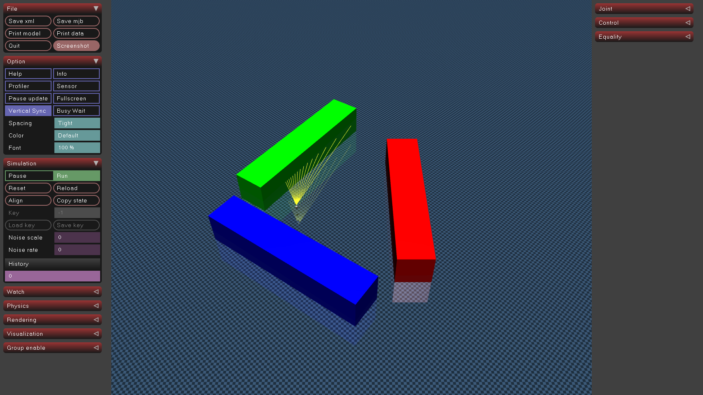
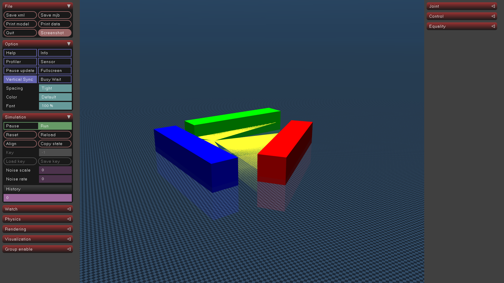
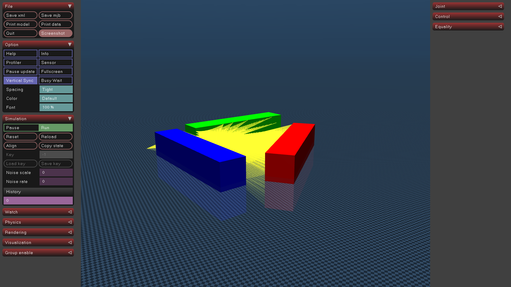

# Lidar Plugin for Mujoco

## [Lidar](include/mujoco_lidar_plugin/lidar.h)

This sensor uses ray casting to simulate lidar.

A `lidar` sensor is associated with a site and finds the nearest collision points from the site along a set of vectors.
The vectors are determined by the size and field of view parameters.

The sensor is parametrized by 5 numbers:

2. Horizontal resolution (size[0]). _positive integer_
3. Vertical resolution (size[1]). _positive integer_
4. Horizontal field-of-view (fov[0]). _positive float in (0, 2 $\pi$.] radians_
5. Vertical field-of-view(fov[1]). _positive float in (0, $\pi$] radians_
6. Maximum Range. _positive float greater than 0.0_

Field of view should always be in radians regardless of the compiler options.

The horizontal fov is divided by the horizontal resolution (hn) to get hn azmuth angles.
The vertical fov is divided by the vertical resolution (vn) to gt vn elevation angles.
Each azmuth/elevation pair defines a vector.
The distance result is the set of distances to collision from the site origin along that vector.

These parameters are passed as plugin config attributes:

```xml
<mujoco>
  <extension>
    <plugin plugin="mujoco.sensor.lidar"/>
  </extension>
  ...
  <sensor>
    <plugin name="lidar" plugin="mujoco.plugin.lidar" objtype="site" objname="lidar_sensor">
      <config key="size" value="360 10"/>
      <config key="fov" value="6.2832 0.7854"/>
      <config key="max_range" value="13.0"/>
    </plugin>
  </sensor>
</mujoco>
```

Note the following:

- The dimensionality of the sensor output is `size_x *size_y`.
- `objtype="site" objname="lidar"` specify that the sensor is associated with a
  site, and the name of the specific site.
- Field-of-view angles are always in radians

### Example model


Lidar with:
 horizontal fov = 45 deg,
 vertical fov = 0,
 horizontal size = 15,
 vertical size = 1



Lidar with:
 horizontal fov = 360 deg,
 vertical fov = 0,
 horizontal size = 360,
 vertical size = 1


Lidar with:
 horizontal fov = 360 deg,
 vertical fov = 45,
 horizontal size = 360,
 vertical size = 4


See [lidar.xml](example/lidar.xml) to play with the model above.

## Build
```
git clone https://js-er-code.jsc.nasa.gov/imetro/imetro-utilities/mujoco_lidar_plugin.git
cd mujoco_lidar_plugin
mkdir build
cd build
cmake ..
make
```

If you have the mujoco binaries in user space, set an environmetn variable MUJOCO_BIN to the location of the mujoco binaries (e.g. simulate).
```
make install
```

If you installed using pre-compiled binaries or installed to /usr/local/bin:
```
sudo make install
```

This will create a mujoco_plugin directory alongside the mujoco binaries and install the lidar plugin there.  It can now be found.

## Test
```
simulate example/lidar.xml
```
